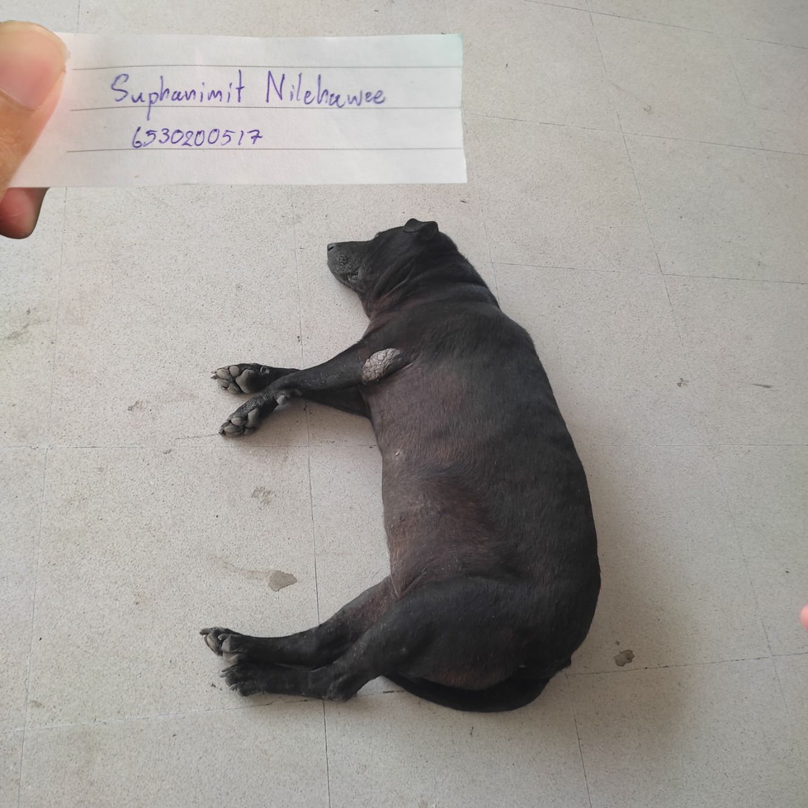

# **Security Control**

### **สุนัขเฝ้ายาม (Guard Dog)**

 **Location**: ใต้ตึก 17
  
 **Control Function**: Preventative
  
 **Type of Security Control**: Physical Control

---

### การทำงานของสุนัขเฝ้ายาม
- สุนัขเฝ้ายาม (Guard Dog) เป็นมาตรการรักษาความปลอดภัยทางกายภาพที่ใช้เพื่อป้องกันภัยคุกคามทางกายภาพ เช่น การบุกรุก ขโมย หรืออันตรายจากบุคคลที่ไม่ได้รับอนุญาต

---

### 🔎 เหตุผล:
- สุนัขเฝ้ายาม (Guard Dog) เป็นหนึ่งในมาตรการรักษาความปลอดภัยที่จัดอยู่ในหมวด Physical Control ซึ่งเป็นการควบคุมทางกายภาพที่ช่วยป้องกันภัยคุกคามที่อาจเกิดขึ้นในพื้นที่ที่ต้องการความปลอดภัยสูง โดยสุนัขเฝ้ายามสามารถทำหน้าที่ได้หลากหลาย ทั้งการเฝ้าระวัง การป้องปราม และในบางกรณีอาจใช้เพื่อโจมตีผู้บุกรุกที่เข้ามาโดยไม่ได้รับอนุญาต 
โดย Control Function จะเป็น Preventive Control ซึ่งสุนัขเฝ้ายามมีบทบาทสำคัญในการป้องกันภัยคุกคามก่อนที่จะเกิดขึ้น การเห่าหรือท่าทางที่ดูดุร้ายช่วยข่มขู่ผู้บุกรุกให้ไม่กล้าล่วงล้ำเข้ามาในพื้นที่ได้

[my profile](https://6530200517.github.io/)

